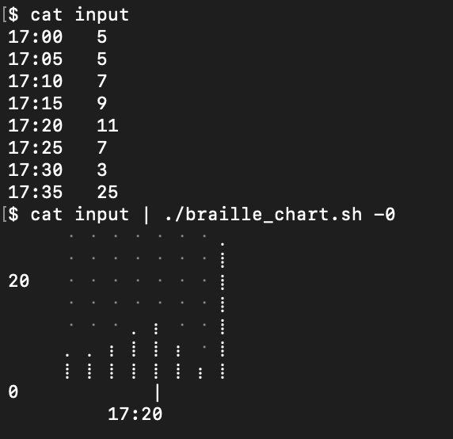

# Scripts

> You guys have to learn this technology. You have to learn how to hack it, or it's going to rule your lives.  
> -John McGowan  

## What's This?

Anything too-small to warrant its own repo, and too-large to fit into trimstray's [one-liner collection](https://github.com/trimstray/the-book-of-secret-knowledge/blob/master/README.md)

### Active Directory Things

[AGNES](AGNES.rb): This script is the functional part of the AGNES password-handling system, which scraped $EMPLOYER's tickting system looking for password reset requests from folks who didn't bring their biometric token to work. If they hadn't set an Active Directory password in the last 89 days AGNES would generate a weakly-random password for them. This script worked in-concert with scripts useless outside of $EMPLOYER's devlab which would handle both ticket scraping and email. The name is a callback to the original mailer sign-off "From Agnes, with love"

[active_directory_last_password_reset.py](active_directory_last_password_reset.py): Get the last reset time for an Active Directory user in epoch seconds.


### Atlassian (Jira/Crowd) Things

[add_me_to_crowd.rb](add_me_to_crowd.rb): "Business" users did not feature in the correct Active Directory OU to appear in $EMPLOYER's Jira instances, and the Windows admins said we shouldn't rearrange things. This microservice queries Active Directory and creates corresponding users in an Atlassian Crowd internal user dir if the user is in the "wrong" OU. Users who *do* feature in the "right" Active Directory are reminded of their username and routed to an independent password reset function. 

[jira_apdex_graphite.py](jira_apdex_graphite.py): Jira started silently collecting [APDEX](https://en.wikipedia.org/wiki/Apdex) metrics as-of 7.12. This script boils metric logs for Grafana.

[jira_attachment_move.sh](jira_attachment_move.sh): A demonstration of moving attachments via REST call with cURL.

[sniper.sh](sniper.sh) & [spotter.sh](spotter.sh): A pair of shell scripts for detecting a problematic Jira plugin and disabling it automatically if it acted-up. Driven by cron, powered by cURL, and a good demonstration of working with the plugin API.

[violet.php](violet.php): $EMPLOYER's Jira 7 deployment scheme revolved around splitting the single legacy instance into a fleet of federated instances, making it impossible to preserve historic sprint data. Violet.php was used to poll and recreate project's historic sprints on their new homes. *Why PHP and cURL?* Because this was initially going to be a self-service model.


### GitHub Things

[ghe_bridge](ghe_bridge): $EMPLOYER pusheed an "everyone in the pool" model for Github Enterprise, including non-engineering staff who may not be comfortable on a Linux commandline and historically had trouble with navigating a .gitconfig file. This microservice and bookmarklet combo allowed for more business-oriented folks to push a button and get a fixed .gitconfig and a repository zipfile for their Github Desktop. 

[git_cat_tree](git_cat_tree.rb): Documentation in Github Enterprise is a great idea! Git runbooks just-in GHE is a *terrible idea*. This is a convenience script for picking docco off of a GHE instance. Why not use a git clone? Because babeld can fail independently.

[scripto.sh](scripto.sh): BASH function to automatically save local typescripts as gist-files on GitHub.com. This functionality is discussed as part of a [dev.to article](https://dev.to/lbonanomi/dear-diary-recording-bash-session-as-github-gists-1nga).


### Jenkins Things

[restart_thrashing_jenkins_master.sh](restart_thrashing_jenkins_master.sh): A quick localized check-and-restart for Jenkins masters.

[jenkins_webhook.py](jenkins_webhook.py): Github Enterprise webhook for sanity checking for Jenkins controller VM Chef cookbooks.


### Linux/Unix Things

[cosanguine.py](cosanguine.py): Calculate cosine text-similarity of files listed in ARGV, mixes well with a little shell glue and [polarizer](https://github.com/lbonanomi/polarizer).  Also available in [Go](https://github.com/lbonanomi/go/blob/master/consanguine.go)  

Thank you to vpekar @ StackOverflow for the math function!

[grouper.py](grouper.py): Calculate (potentially weighted) cosine text-similarity of files listed in ARGV like [cosanguine.py](https://github.com/lbonanomi/scripts/blob/master/cosanguine.py), but group files together on STDOUT line.

[jaccard.py](jaccard.py): A debt collection tool that compares the similarity of files from ARGV using jaccard indices. This proved super-handy for checking ```rpm -qa``` lists between legacy peer hosts. Also available in [Go](https://github.com/lbonanomi/go/blob/master/jaccard.go)  

[natural.php](natural.php): $EMPLOYER's legacy app framework uses a logging scheme that rolls logfiles over after they hit ~30MB, appending some variation of a timestamp to the old filename. This can lead to very-full directories without any single file being over-large, preventing chats about log management with any particular development group. This script trolls a directory building a database of metaphone3 values for all file names and tabulates corresponding sizes. A less featureful (but less snarled) [python](https://github.com/lbonanomi/scripts/blob/master/natural.py) port is available, too.

```bash
$ ~/natural

FILES LIKE a_service_name_2018-04-14T00:00:21.log: 6 files consuming 10.45 GB (4.74% of /logs)
FILES LIKE b_service_name.log.20180418_130954: 274 files consuming 8.34 GB (3.78% of /logs)
FILES LIKE c_service_name.20171016: 189 files consuming 7.86 GB (3.57% of /logs)
FILES LIKE d_service_name.txt: 1 files consuming 7.25 GB (3.29% of /logs)
FILES LIKE e_service_name.log.20180214_074502-191631: 90 files consuming 4.79 GB (2.18% of /logs)
```

[suwho.sh](suwho.sh): Record-keeping at $EMPLOYER wasn't always what it is now and security remains a distinct silo, so there are application LDAP accounts with no clear line of ownership. This script is jammed into the /etc/skel profile to help find active sudo calls to application accounts. Also available in [Go](https://github.com/lbonanomi/go/blob/master/suwho.go). The mechanics of determining sudo-ed users is also discussed as part of a [dev.to article](https://dev.to/lbonanomi/dear-diary-recording-bash-session-as-github-gists-1nga).  


### Visualization Things

[braille_chart.sh](braille_chart.sh): I <3 the idea of welding  [sparklines](https://github.com/holman/spark) and [Grafana's](https://grafana.com) handsome line charts together in terminal. To try and keep things compact while still-showing discrete counts, values are displayed in 8-dot braille. *Please note:* this script is fun at the expense of both efficiency and sanity. 


